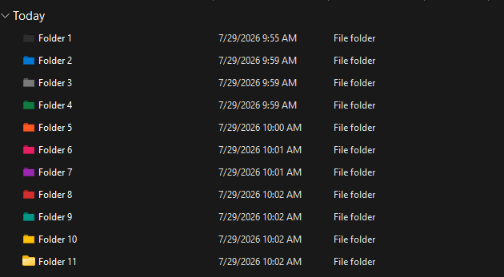
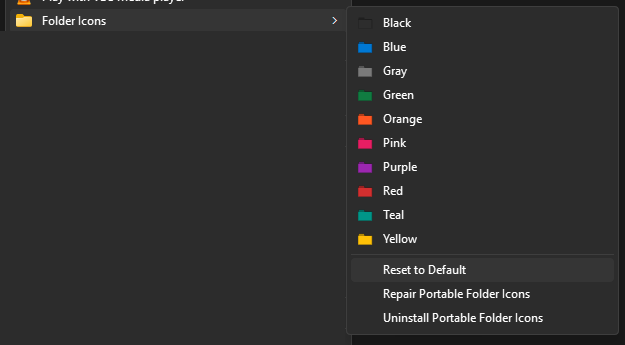
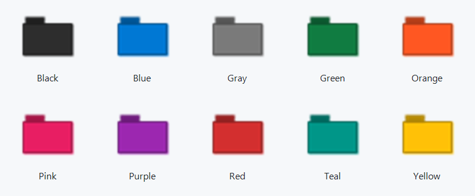

# Portable Folder Icons

Give Windows folders a clear visual identity from Explorer. Portable Folder
Icons installs a current-user **Folder Icons** submenu with ten included colors,
custom ICO discovery, Reset, Repair, and Uninstall—without administrator rights
or an Explorer restart.



## Features

- Ten included folder colors
- Windows 10 and Windows 11 with inbox Windows PowerShell 5.1
- Current-user installation: no administrator rights or UAC
- Classic Explorer context-menu submenu
- Custom ICO discovery and rescan
- Safe Reset, Repair, and Uninstall actions
- No Python, downloads, telemetry, Explorer restart, or global icon-cache deletion

## Install

1. Download or extract the complete repository ZIP to a writable folder.
2. Double-click `Setup_and_Run-Portable-Folder-Icons.bat`.
3. Confirm the results show the expected accepted icons, then press Enter.

The launcher refuses elevation. If Windows SmartScreen warns about the unsigned
download and you trust its source, choose **More info** and **Run anyway**.
Setup installs a self-contained runtime under
`%LOCALAPPDATA%\Portable-Folder-Icons` and registers only current-user (`HKCU`)
menu entries.

## Use

Right-click one normal writable folder. On Windows 11, select **Show more
options**, open **Folder Icons**, and choose a color.



**Reset to Default** removes this tool's icon customization while preserving
unrelated `desktop.ini` content. **Repair** validates the installed runtime and
cached icons, then recreates the menu. **Uninstall** removes the menu, runtime,
manifest, and installed settings after confirmation.

### Folder colors



### Add custom ICO files

Place `.ico` files directly in `files\ICO-Files`, then rerun setup to rescan.
Subfolders are not scanned. Filenames become menu labels: `Folder_Blue.ico`
becomes **Blue**, and underscores become spaces. Invalid icons and duplicate
labels are reported without replacing a working installation.

Previously applied folders keep working because cached icons are retained.
Only redistribute custom icons when you have permission to do so.

## Developer Mode

Normal operation is silent: Apply and Reset run in a hidden PowerShell window
and show no success dialog. Errors still display a useful dialog.

To see progress and the completion or warning dialog during diagnosis, edit
`config.toml` before running setup:

```toml
[settings]
developer_mode = true
```

Only the TOML Boolean values `true` and `false` are accepted. Rerun setup after
changing the value. Setup persists the effective setting in the installed
runtime, so menu actions do not depend on the repository remaining in place.
Repair preserves that installed setting.

## Explorer refresh limitation

An already-open Explorer view may retain the previous folder color until
refreshed. Press F5, navigate away and back, or open a new Explorer window/view
to display the current color. Reset normally updates immediately.

The customization is still saved correctly. The tool does not restart Explorer
or clear Windows' global icon cache.

## Troubleshooting

- **Folder Icons is missing:** rerun setup normally. If the repository is no
  longer available, use the installed Repair command.
- **An ICO is rejected:** check its setup-results row. It must be readable,
  non-empty, valid, and have a unique normalized label.
- **A color looks stale:** use F5, navigate away and back, or open a new view.
- **A cache-integrity error appears:** run Repair, then rerun repository setup
  if source icons must be imported again.
- **Access is denied:** choose a local NTFS or ReFS folder you own. Filesystem
  roots, network paths, Windows system folders, protected application folders,
  and unwritable locations are intentionally rejected.

## Uninstall

Choose **Folder Icons → Uninstall Portable Folder Icons** and confirm. The
default keeps cached icons so previously customized folders do not break.
An additional explicit warning appears before optional cache deletion.
Uninstall does not modify customized folders.

## Privacy and security

Portable Folder Icons has no telemetry and requires no internet connection,
administrator rights, or machine-wide registry changes. It uses only
current-user registry entries and validates cached ICO content by SHA-256.

## Roadmap

Multi-folder selection is planned for a future release.

## License and icon rights

The code and ten bundled ICO assets are distributed under the root
[MIT License](LICENSE); the copyright holder has confirmed redistribution
permission for those assets. User-added icons remain the user's responsibility.
